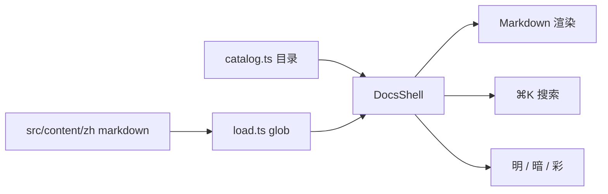
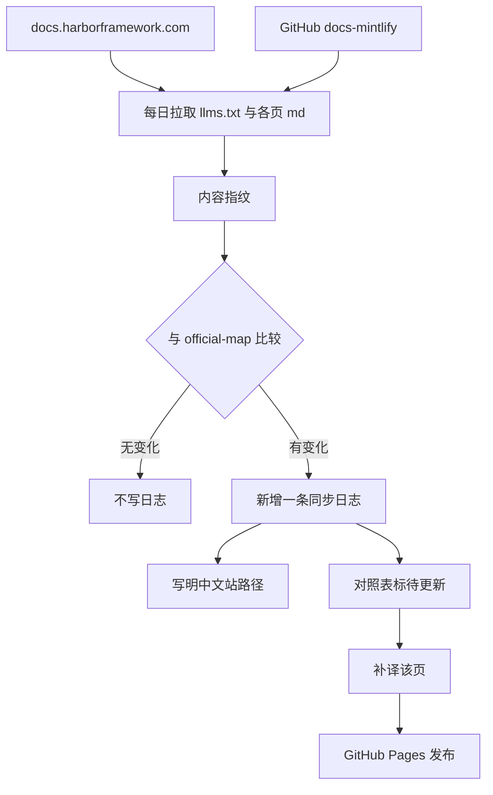

# 本站架构 {#architecture}

> 手册页面怎么拼起来，以及每日同步如何驱动永久汉化。

## 阅读器 {#reader}

- 正文是 `src/content/zh/**/*.md`，路径与官网一致，例如 `/docs/core-concepts/jobs/run-a-job`。
- `catalog.ts` 决定侧栏分区和上一篇 / 下一篇。
- 标题可带 `{#english-id}`，与官网锚点对齐。
- 代码块、表格、Mermaid、站内链接由 `Markdown.tsx` 渲染。

## 同步驱动 {#sync-flow}

1. **指纹**：`official-map.json` 记下每一页的 GitHub blob SHA 和中文站 `webPath`。对照表打开时用同一套 SHA，避免误报「待更新」。
2. **对照**：GitHub Actions 每天拉 `docs-mintlify` 树；浏览器打开对照表时也会对照 GitHub 树（缓存 6 小时）。
3. **日志**：有 diff 就在 `update-logs.ts` 头插一条，列出「改了什么 / 中文站哪一页 / 官网 URL」。
4. **汉化**：只重翻待更新的页，不整站重来。新页会自动建档，补译后用 `--mark-translated` 对齐。

## 发布 {#publish}

- 预览：本仓库的开发服务器。
- 静态站：`npm run build:pages`，产物在 `.output/public`。
- GitHub Pages：推 `main` 后由 `.github/workflows/pages.yml` 构建；每天例行同步由同一工作流的 cron 触发。

Harbor 是 [harbor-framework](https://github.com/harbor-framework/harbor) 的产品。本仓库只提供中文阅读与对照，不替代官方文档。
