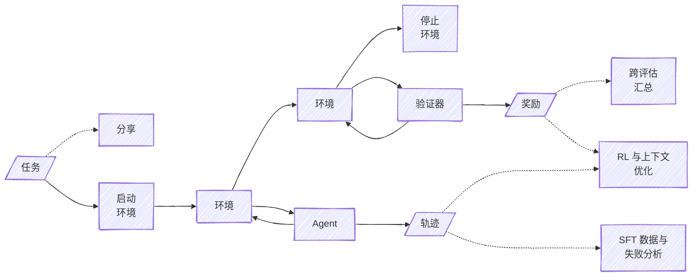

# 概览 {#overview}

> Harbor 任务由指令、环境和测试脚本组成。

Harbor 任务由指令、环境和测试脚本组成。任务定义为具有如下结构的文件目录：

```bash
my-task/
├── instruction.md
├── task.toml
├── environment/
│   ├── Dockerfile  # or some other spec
│   └── ...
├── solution/
│   ├── solve.sh
│   └── ...
└── tests/
    ├── test.sh
    └── ...
```

环境可以使用任意规范来定义，只要任务的使用者（例如 Harbor 框架）支持该规范即可。常用规范包括 `Dockerfile`、`docker-compose.yaml`（用于多容器环境）以及 `Apptainer.def`（用于 HPC）。

## 试次 {#trials}

Harbor 试次是 Agent 完成某项任务的一次尝试。下图展示了任务的各个组件在试次中如何被使用。



## 奖励 {#rewards}

任务在 `tests/test.sh` 脚本中定义验证指令是否完成并生成奖励的逻辑。该脚本必须在环境中的 `/logs/verifier/reward.txt` 或 `/logs/verifier/reward.json`（用于多维或带标签的奖励）写出一个数值奖励。

## 独立、隔离、可复现 {#independent-isolated-and-reproducible}

Harbor 任务是独立、隔离、可复现的代码片段。Harbor 任务不依赖 Harbor 框架。它们可以轻松接入任何支持 Harbor 格式的框架。不过，Harbor 框架是大规模运行任务的简便起点。

可以把任务理解为软件包：应当自包含、有版本、持续维护并随时间演进。

## 任务组件 {#task-components}

* [`instruction.md`](/docs/core-concepts/tasks/instruction)
* [`task.toml`](/docs/core-concepts/tasks/configuration)
* [`environment/`](/docs/core-concepts/tasks/environment)
* [`solution/`](/docs/core-concepts/tasks/solution)
* [`tests/`](/docs/core-concepts/tasks/verifier)

## 多步骤任务 {#multi-step-tasks}

Harbor 任务可以拆成多个步骤，每个步骤拥有各自的指令、测试和题解。多步骤任务非常适合为长程任务定义里程碑、测试记忆等持续学习方法，以及观察 Agent 在既有工作基础上继续推进的能力。

详见 [多步骤](/docs/core-concepts/tasks/multi-step)。

```bash
my-task/
├── task.toml
├── environment/
│   ├── Dockerfile  # or some other spec
│   └── ...
├── tests/
│   ├── helpers.py
│   └── ...
└── steps/
    ├── step-1/
    │   ├── instruction.md
    │   ├── tests/
    │   │   ├── test.sh
    │   │   └── ...
    │   ├── solution/
    │   │   ├── solve.sh
    │   │   └── ...
    │   └── workdir/
    │       ├── setup.sh
    │       └── ...
    └── step-2/
        └── ...
```

`Dockerfile` 可以替换为其他受支持的环境规范。`tests/helpers.py` 中的共享评分工具以及每个步骤的 `workdir/setup.sh` 脚本均为可选。目录中还可以包含其他辅助文件。

每个步骤的测试脚本都可以使用共享工具。同时支持作为回退的基础 `tests/test.sh`，供没有自有测试脚本的步骤使用；步骤专属的 `test.sh` 会覆盖它。
