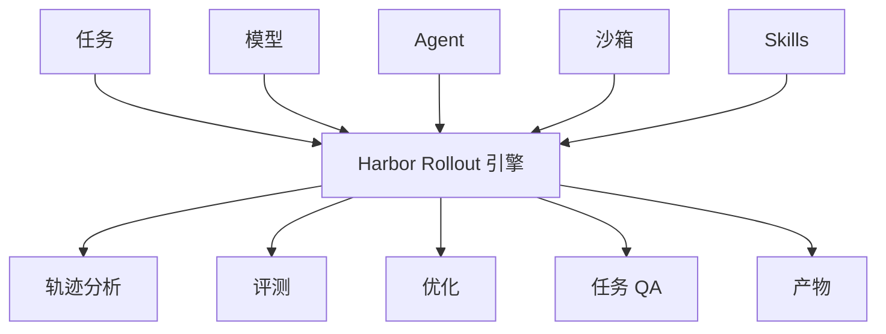

# Harbor 文档 {#harbor-documentation}

> 用 Harbor 评测和优化 Agent 与模型。

Harbor 是一个框架：任意 Agent、任意模型、任意任务、任意沙箱，都可以并行跑。

- **[快速开始](/docs/getting-started/quick-start)** — 用 Harbor 跑第一次评测。
- **[运行作业](/docs/core-concepts/jobs/run-a-job)** — 在任务和数据集上跑 Agent。
- **[任务概览](/docs/core-concepts/tasks/overview)** — 理解 Harbor 任务格式。
- **[创建任务](/docs/tutorials/create-a-task)** — 编写并测试你的第一个任务。

本站是 [docs.harborframework.com](https://docs.harborframework.com/) 的中文手册，路径与官网对齐。官网一有更新，顶栏「同步」会记一笔：[同步日志](/docs/updates) 写明改了什么、中文站在哪一页。
